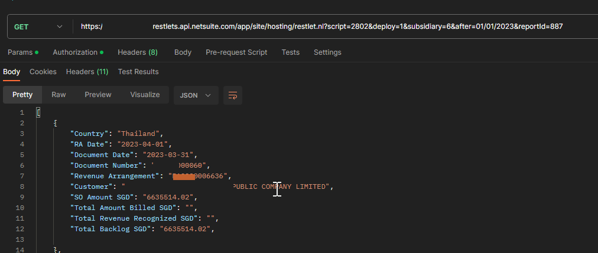
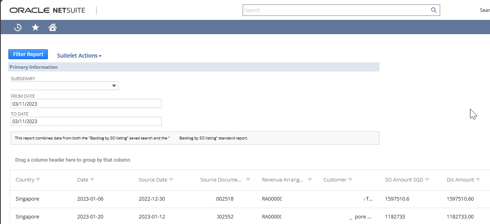

# NetSuite Saved Report 

This script is designed to retrieve data from a NetSuite saved report using Restlet.

#### Suitelet Example: Retrieves Data from a Saved Report and Joins it with a Saved Search Datasource

## Function: `getReportData(datain)`

This function is the entry point for running a NetSuite report. It takes a `datain` object as its parameter and performs the following steps:

1. Initializes default parameters, such as `reportId`, `subsidiary`, and `after`.
2. Calls the `validateParams` function to ensure that the input parameters are valid.
3. Constructs report settings using the `reportSettings` function.
4. Runs the NetSuite report using `runReport` with the specified `reportId` and settings.
5. Returns the processed report data by calling the `handleReportResults` function.

## Function: `reportSettings(params)`

This function creates a report settings object based on the input parameters. It sets up subsidiary and criteria filters, including location, department, and class. The function takes the following parameters:

- `params.subsidiary`: The subsidiary ID for the report settings.
- `params.after`: The date filter for the report settings (optional).

## Function: `validateParams(params)`

The `validateParams` function is responsible for validating the input parameters. It ensures that the `datain` object is defined and converts it to a JavaScript object if necessary. It also checks for mandatory parameters (e.g., `reportId`, `after`, and `subsidiary`). If any validation fails, it throws an error.

## Function: `handleReportResults(pivotTable)`

This function processes the results of a NetSuite report in a pivot table format. It extracts columns and rows, iterating through them to create an array of processed report data. It handles rows, child rows, and account rows and checks for row validity.

### Usage

To use this script, you can call the `getReportData(datain)` function with the necessary input parameters in your Restlet script. Ensure you have the required permissions and access to the NetSuite report with the specified `reportId`.

Feel free to modify and customize this script to suit your specific needs and report requirements.
